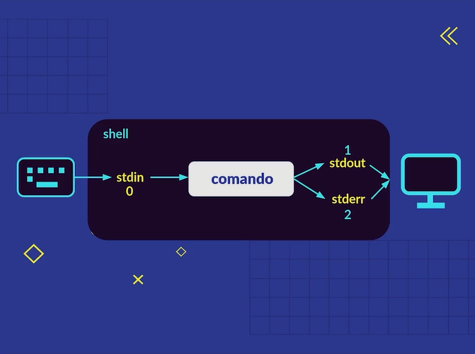
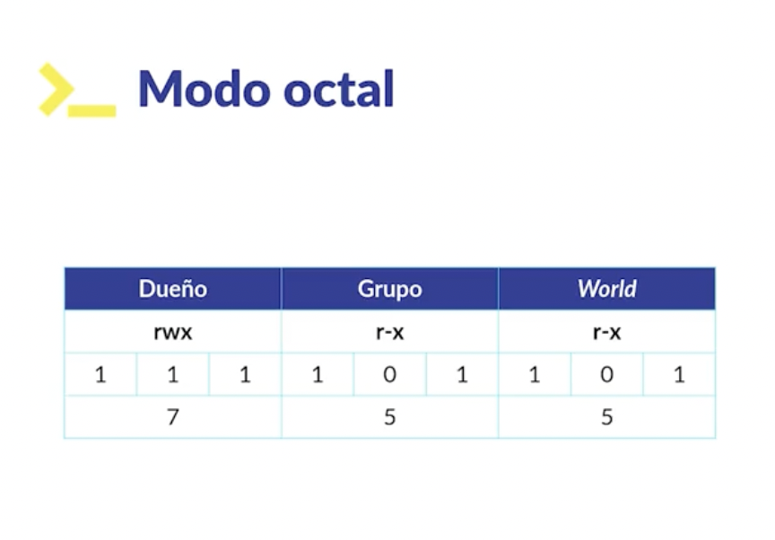
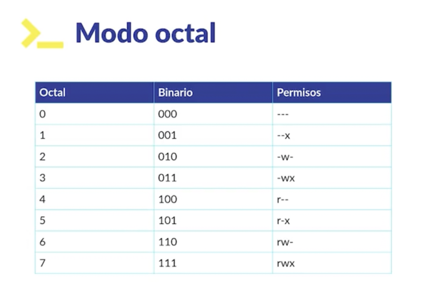
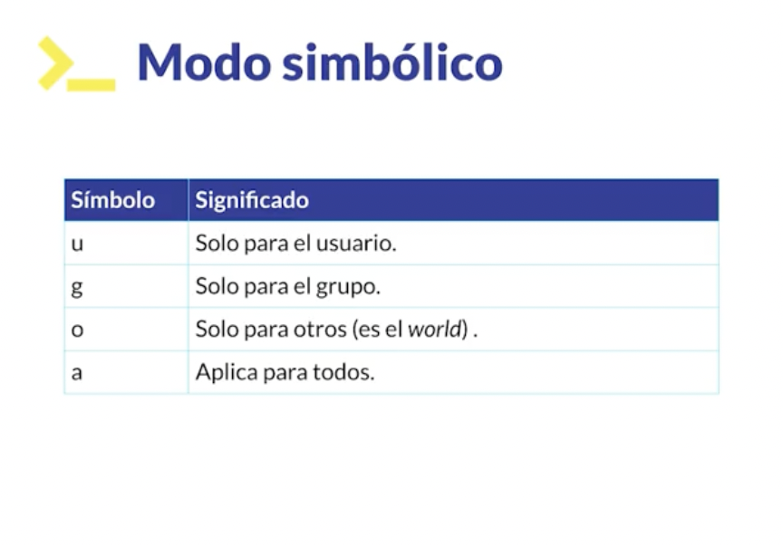
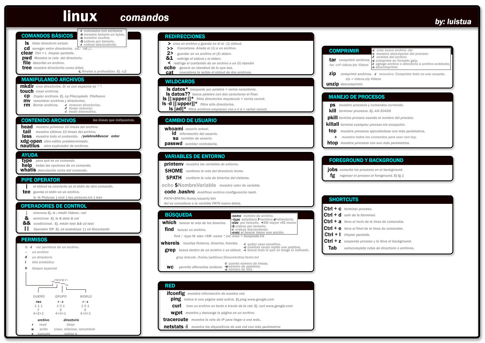

# Commands

1. ls : listar archivos

**nota**: el simbolo ~ nos indica que estamos en la carpeta **Home**

**FLAGS:**

- -l (long)
- -lh (long human)
- -la (long all) : todos los archivos incluso ocultos
- -lSh (long size): ordena por tamano
- -lr : lista alfabeticamente en reverso

2. cd: cambiar de directorio

- NOTA:

* cd ejecutado solo te lleva a home
* se escribe la inicial de un archivo o carpeta y luego se presiona tab para autocompletar

3. clear / ctrl + l: limpia consola

4. pwd (print working directory): muestra ruta actual

5. file [archivo]: detalle de un archivo

## Creando(carpeta-archivo)/copiar/mover/eliminar

6. mkdir: crear carpeta
7. touch [archivo]: crear archivo
8. cp archivo_a_copiar archivo_copia: copiar un archivo
9. mv (move) nombre_archivo ruta: mover un archivo
10. mv archivo renombrado: renombrar un archivo
11. rm -i archivo: eliminar un archivo
12. rm -ri (recursive interactive) [carpeta]: para borrar una carpeta y su contenido

## Explorando contenido de un archivo

13. head nombre_archivo: muestra las 1eras 10 lineas del archivo

- -n nro_lineas: cambia el nro de lineas a mostrar por defecto

14. tail nombre_archivo: muestra las ultimas 10 lineas del archivo
15. less nombre_archivo; muestra el archivo

- colocando "/" seguido de una busqueda te hace un a busqueda

16. type [command]: permite ver tipo de comando

## Creando un alias

17. alias l="ls -lh"
    (los alias solo se crean por sesion de terminal)

## Ver informacion de un commnad

**Que es un comando**

Un comando es un mensaje enviado al ordenador que provoca una respuesta en este sistema y se comporta como una orden, pues informa al dispositivo informático que debe ejecutar una acción según la indicación que pueda enviarse.

**Un comando pueden significar cuatro cosas:**

- Un programa ejecutable
- Un comando de utilidad de la shell. Esto es un programa en sí mismo, que puede tener funciones. Ejemplo cd
- Una función de shell. Son funciones de shell externas al comando de utilidad. Ejemplo mkdir
- Un alias.

18. man [command]
19. info [command]
20. whatis [command]
21. [command] --help
    ejemplo: man cd

**Wildcards**

Permite realizar busquedas avanzadas y filtrado.

22. ls \*.txt / ls file\* / ls file???(cantidad de caracteres) : busqueda de arch que terminen en .txt
23. ls -d [[:upper:]]\*: busca archivos que empieza por mayusculas
24. ls -d [[:lower:]]\*: busca archivos que empieza por minusculas
25. ls [ad]\*: busaca arch que empiezan por a o d
26. ls -l \*.png

**TABLA DE WILDCARDS**

| wildcard | Funcion                           |
| -------- | --------------------------------- |
| \*       | Busca todo                        |
| ?        | Busca opr cantidad de caracteres  |
| []       | Busca por acracteres especificaos |

## Redirecciones

27. ls [from] > [to]: si se usa doble >> concatena la info que ya tiene con la nueva

## Que son las entradas y salidas en terminal

En la consola nosotros generamos una entrada cuando escribimos y una salida casi siempre que ejecutamos un comando.

A las entradas típicamente se les suele llamar Standard Input y a las salidas Standard Output, además se les suele abreviar como stdin y stdout respectivamente.

**Qué son file descriptors**
Los file descriptors son números que identifican un recurso. Funciona asociando un número con una acción, archivo o programa, en el caso de la shell tenemos 3 file descriptors:



**Operador de redirección (>)**
A veces queremos guardar la información de una salida porque nos puede interesar almacenar lo que esa salida contiene. Veamos el siguiente ejemplo, si utilizas el comando:

```shell
ls -l > output.txt
```

**concatenar (>>)**
Suponiendo que ya tienes el archivo output.txt y ahora también quieres guardar la información de la carpeta de documentos, entonces no puedes volver a ejecutar:

```shell
ls -l >> output.txt
```

**Redirección de errores (2>|2>&1)**
El operador de redirección por defecto solo redirecciona el file descriptor 1 (es decir, el Standard Output). Pero, ¿qué tal si queremos redirigir un error? Pues tenemos que especificar que queremos el Standar Error, que tiene el file descriptor 2.

```shell
ls -lñ 2> error.txt
head error.txt
```

**También podemos especificar que no importa lo que pase si me da un Standar Ouput o un Standar Error, igual tiene que guardar la salida en un archivo. Esto lo hacemos así:**

```shell
ls -l > output.txt 2>&1
```

La orden 2>&1 significa que debe redirigir el file descriptor 2 y el file descriptor 1.

**TABLA DE operadores**

| opperador | Funcion                                                                                   |
| --------- | ----------------------------------------------------------------------------------------- |
| >         | Redirecciona la salida. Por defecto redirecciona el Standar Output                        |
| >>        | Concatena la salida con lo que ya tenga el archivo a donde se está redirigiendo la salida |
| 2>        | Redirecciona el file descriptor 2 (En este caso Standar Error)                            |
| 2>&1      | Redirecciona el file descriptor 2 y 1                                                     |

## Imprimir un mensaje

```shell
echo "Hello world!"
```

## Cat (concatenar contenido de archivos)

```shell
cat output.txt error.txt
```

## pipe operator (concatena comandos)

Permite que standard output se convierta en el standard input de otro comando

```shell
ls -lh | less
```

## Crear un archivo con base en una salida (tee) (Crea un archivo en base a una entrada)

Si queremos guardar la lista creada anteriormente, podemos pasar esa salida por medio de un pipe operator al comando tee, el cual creará un archivo con esa salida.

```shell
cat images.txt secretosDeEstado.txt | tee archivos.txt
```

## Organizar archivos con sort

```shell
ls | sort | tee archivosHome.txt
```

```shell
cowsay "Hola Lexfer" | lolcat | tee vaca.txt
```

## Encadenando comandos: operadores de control

```shell
ls; mkdir holi; cla
```

## Encadenando comandos: operadores de control de forma asincrona (se ejecutan al mismo tiempo)

```shell
ls & date & cal
```

## Condicionales && (se ejecutan solo si el comando anterior fue exitoso)

```shell
mkdir directoriio && cd directoriio
```

## Permisos

---

 

---

 

---

 

## Modificando permisos en la terminal

> mitexto.txt : crea un archico y te permite agregar informacion(para salir ctrl + d)

```shell
-rw-r--r--  1 lexferfrancisco  staff  31 Nov 27 10:49 mitexto.txt
```

tiene read/write para el usuario, read para grupos y read para world

**Cambiando los permisos con chmod (change mode)**

```shell
chmod 755 mitexto.txt
```

**Eliminando los permisos de read al user(u-r)**

```shell
chmod u-r mitexto.txt
```

**Agregando los permisos de read al user(u+r)**

```shell
chmod u+r mitexto.txt
```

**Eliminando los permisos de read al user(u-r) y write a grupo y world**

```shell
chmod u-r,go=w mitexto.txt
```

**Ver mi user y cambiar de user**

```shell
whoami
```

**su(switch user)**

Permite cambiar usuario eje: su root

## Cómo configurar variables de entorno

- ver variables de entorno

```shell
printenv
```

- imprimir variables de entorno

```shell
echo $HOME
```

## Modificar la variables de entorno PATH (agregar una ruta nueva al PATH)

```shell
PATH=$PATH:/home/Document...
```

## búsqueda en la terminal

```shell
find [rutaDesdeDondeEmpezarBuscar] [opciones]
```

**Banderas del comando find
Banderas básicas:**

-name: Realiza una búsqueda por nombre de archivo.
-iname: Realiza una búsqueda por nombre de archivo sin tomar en cuenta las mayúsculas o minúsculas.
-type: Realiza una búsqueda por tipo de archivo, f(files) y d(directories) que son los más comunes.
-size: Realiza una búsqueda por el tamaño de archivo y/o directorio.

```shell
find ./ -name *.png
```

## Usando el comando grep

“Grep” significa Global Regular Expression Print
El comando grep utiliza regex (Regular Expression) para realizar su búsqueda

```shell
grep [ExpresiónRegular] [archivoDondeBuscar]
# ejemplo
grep Towers movies_afffe2e6-a55c-47f0-8895-9d37c9cd9eb8.csv
# case sensitve
grep -i  Towers movies_afffe2e6-a55c-47f0-8895-9d37c9cd9eb8.csv
# ocurrencias con case sensitve
grep -ci  Towers movies_afffe2e6-a55c-47f0-8895-9d37c9cd9eb8.csv
# excluye ocurrencias con case sensitve
grep -vi  Towers movies_afffe2e6-a55c-47f0-8895-9d37c9cd9eb8.csv
```

```shell
# cantidad de palabras
wc -w movies_afffe2e6-a55c-47f0-8895-9d37c9cd9eb8.csv
# cantidad de lineas
wc -l movies_afffe2e6-a55c-47f0-8895-9d37c9cd9eb8.csv
```

## Utilidades de red

ifconfig: informaciond de nuestra red
ping: ver si responde una red o pag web
curl: ver contenido de una pg

```shell
curl www.google.com > index.html
```

wget: descarga archivo a nuestra pc(descarga de paquetes)

## Manejo de procesos

ps: lista los procesos en ejecucion, eje: cat & ps

```shell
lexferfrancisco@MacBook-Air-de-Lexfer curso terminal linux % cat & ps
[2] 18010
[2]  + suspended (tty input)  cat
  PID TTY           TIME CMD
11011 ttys000    0:00.07 /bin/zsh -l
11140 ttys001    0:01.45 -zsh
18008 ttys001    0:00.01 cat
18010 ttys001    0:00.00 cat
```

kill [ID process]: permite cerrar procesos

```shell
kill 18008
```

## vim

vim: entrar a editor vim
:q => salir del editor vim
presionar la tecla i: para entrar en modo de insersion
presionar esc para sallir de modo de edicion => para hacer busqueda colocar : /[palabra a buscar]
:w => para guadar
:wq! => para guadar y salir

 
